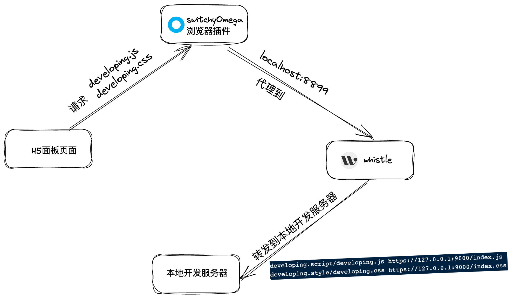

# iotexplorer-h5-panel-template

腾讯连连(腾讯云物联网控制端)自定义H5面板开发面板demo vue版 ,项目通过 [CAZ template](https://github.com/zce/caz)创建

如需要 react 框架版本[请点击查看](https://github.com/tencentyun/iotexplorer-h5-panel-demo)


## 使用说明

如果您还不了解 h5 面板，可以查看[快速入门](https://cloud.tencent.com/document/product/1081/49027)及[开发指南](https://cloud.tencent.com/document/product/1081/49028)

## 开发配置

准备环境: [Node.js](https://nodejs.org) (>= 12.10 required, >= 14.17 preferred), [npm](https://www.npmjs.com) (>= 6.x) or [yarn](https://yarnpkg.com) (>= 1.22) [whistle](https://github.com/avwo/whistle) and [SwitchyOmega](https://github.com/FelisCatus/SwitchyOmega).

所需工具和实现原理：
[SwitchyOmega](https://github.com/FelisCatus/SwitchyOmega).

通过添加 `proxy SwitchyOmega`, 将在浏览器中的访问的请求通过该插件代理到 `http://127.0.0.1:8899`(whistle所在的 node 服务) ，再通过 whistle 将请求代理到本地开发服务器(http://localhost:9000)。



[whistle](https://github.com/avwo/whistle)使用

工具安装后，通过 `whistle start` 启动代理服务，通过 浏览器访问 `127.0.0.1:8899` 
在 whistle 页面的，新建 rule 规则 ，配置如下：

```shell
developing.script/developing.js https://127.0.0.1:9000/index.js
developing.style/developing.css https://127.0.0.1:9000/index.css
# https://iot.cloud.tencent.com:9000 https://127.0.0.1:9000 # 用于支持HMR 可以不用
```

开始初始化面板项目

```bash
# create h5-panel apps by this template
$ npx caz tencentyun/iotexplorer-h5-panel-template my-h5-panel

# 如果全局安装了 caz
$ caz tencentyun/iotexplorer-h5-panel-template my-h5-panel

$ cd my-h5-panel

$ npm run dev -- --productId=your_product_id --deviceName=your_devicename # -deviceName为选填，然后会自动打开面板页面
```

## 常见问题

Q: 打开的页面白屏
> A: 请检查 whistle 配置是否正常

Q: 打开的页面报400
> A: 请在`npm run dev`时传入正确的 productId

Q、wistle 导入https证书通过中间人方式解决https 抓包问题。
> A: [解决方法](https://jingyan.baidu.com/article/c843ea0bc4142a77921e4a79.html)

Q、chorme 抓取https包提示不是私密链接的问题
> A: [解决方案](https://blog.51cto.com/u_15399817/4583253)

## Related

- [zce/caz](https://github.com/zce/caz) - A simple yet powerful template-based Scaffolding tools.

## Contributing

1. **Fork** it on GitHub!
2. **Clone** the fork to your own machine.
3. **Checkout** your feature branch: `git checkout -b my-awesome-feature`
4. **Commit** your changes to your own branch: `git commit -am 'Add some feature'`
5. **Push** your work back up to your fork: `git push -u origin my-awesome-feature`
6. Submit a **Pull Request** so that we can review your changes.

> **NOTE**: Be sure to merge the latest from "upstream" before making a pull request!

## License

[MIT](LICENSE)


[travis-img]: https://img.shields.io/travis/com/tencentyun/h5-panel-template
[travis-url]: https://travis-ci.com/tencentyun/h5-panel-template
[dependency-img]: https://img.shields.io/david/tencentyun/h5-panel-template
[dependency-url]: https://david-dm.org/tencentyun/h5-panel-template
[devdependency-img]: https://img.shields.io/david/dev/tencentyun/h5-panel-template
[devdependency-url]: https://david-dm.org/tencentyun/h5-panel-template?type=dev
[style-img]: https://img.shields.io/badge/code_style-standard-brightgreen
[style-url]: https://standardjs.com
